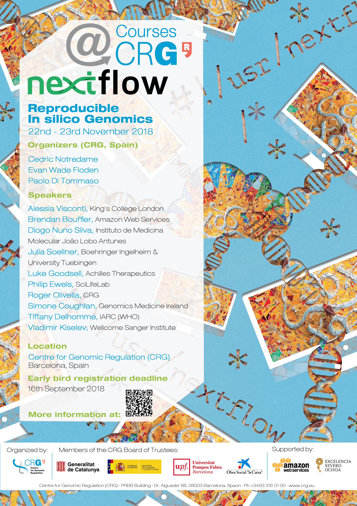
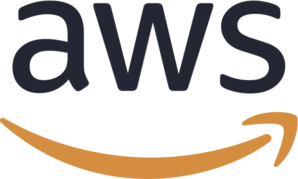

# Nextflow hackathon 2018  

Project repository for the Nextflow hackathon that 
will take on 22-23 November 2018 in Barcelona. 

### Location 

Centre for Genomic regulation (CRG), [PRBB building](https://www.google.es/maps/place/CRG/@41.3853788,2.191863,17z/data=!3m1!4b1!4m5!3m4!1s0x12a4a305ffd98f7b:0xd9cd1df01bab41bc!8m2!3d41.3853788!4d2.1940517?hl=en) (you will need an ID card to enter in the building).  

### Schedule 

The preliminary schedule is available [here](schedule.md).

### Abstracts 

The presentation abstracts are available at [this link](abstracts.md).

### Event chat

We will use the following Gitter [channel](https://gitter.im/nextflow-io/nf-hack18) during the workshop activities. Feel free to register and use it for any question about logistic, problems, doubts during the hackathon, etc. 

### Poster 

### Sponsors 

